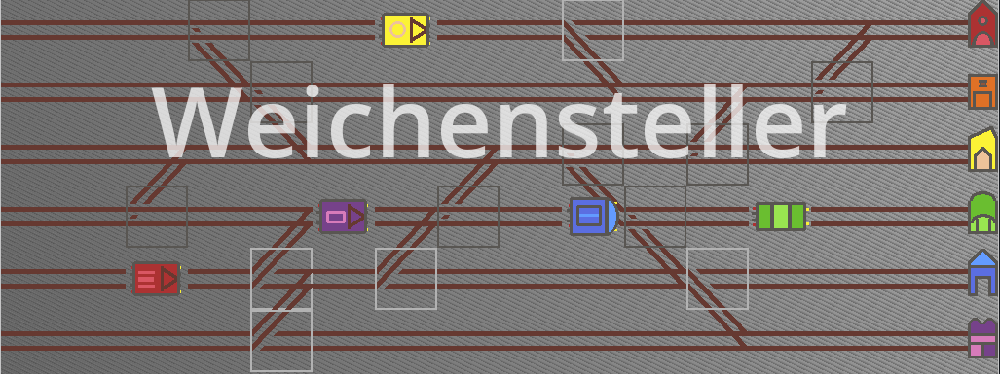
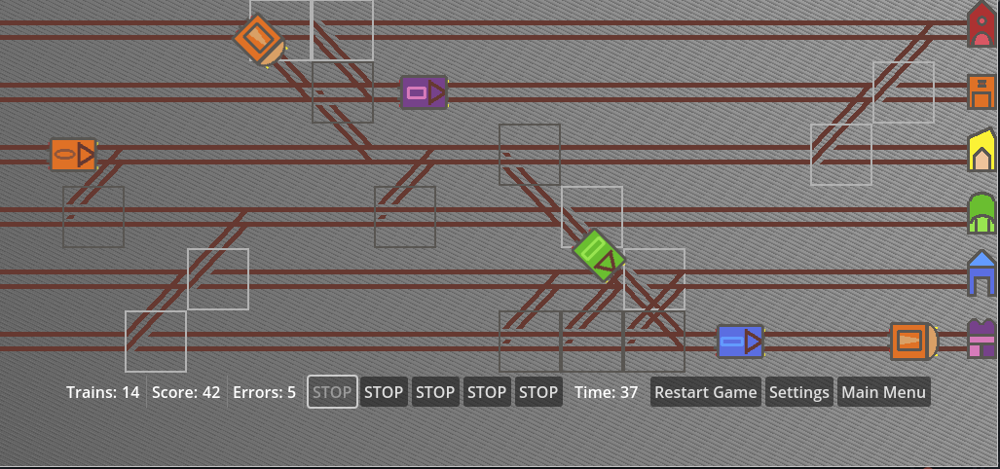

# Weichensteller / Switchman

 

## How to Play

Just go to [https://weichensteller.online/](https://weichensteller.online/) and wait for the game to load.

The rules are simple: Click on the switches to guide the trains to the right destinations (indicated by color).
It starts slowly but gets faster and harder over time. Hurry up to set up the correct path!

 

## Settings

There are settings to adapt the difficulty. If you play in a "placid mode", you collect points slower, though.

 

## Highscore

You can have your scored saved online. Just enter your name and select your age. (There are differentt lists for different ages to give minors a chance to get to the front. Just be honest!)

# Contribute

If yo have any ideas, feel free to open an issue or even use a pull request. The chances that I have time to pick those up are low, though.
